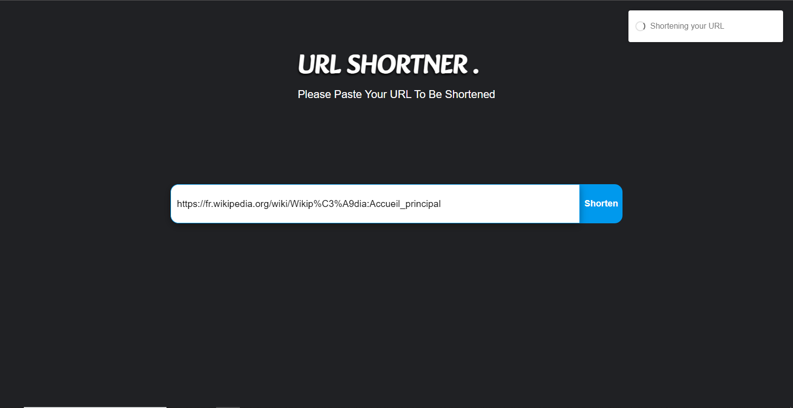

## **URL Shortener 🔗**

This is a URL shortener web application built with Node.js Express on the backend and React.js on the frontend. It uses MySQL as the database to store the URL mappings.

[](https://github.com/Ekep-Obasi/URL-Shortner)

[View Deployment](http://localhost:5050/api/v1/new/ef0f97c1-1afa-4928-8e9c-dabde7ac8ee6)

## **Features 🚀**

* Shorten any valid URL 🎯
* Copy the shortened link to your clipboard with a single click 🖱️
* Receive an error message when the input is invalid ⚠️

## **Prerequisites 🧰**

* Node.js 
* MySQL 
* React.js 

## **Installation 🛠️**

1. Clone the Repo

```sh
git clone https://github.com/Ekep-Obasi/URL-Shortener.git
```

2. Setting up front-end

- Run the following command in your terminal if you have node installed

```sh
cd client/
npm install
npm start
```

2. Setting up front-end

- Change server/.env.example file to server/.env and setup env variables

- Run the following command if you have node installed
```sh
cd server/
npm install
npm start
```


## **Usage 💁**

1. Open the React development server in your web browser:

```sh
http://localhost:3000
```

2. Enter a valid URL in the input field and click the "Shorten" button 🎯
3. The shortened link will be displayed in the output field 📋
4. Click the "Copy" button to copy the shortened link to your clipboard 🖱️

## **Contributing 🤝**

If you would like to contribute to this project, please read the contribution guidelines: CONTRIBUTING.md.

## **Additional Information 💡**

This URL shortener application is still under development, but it is already functional and can be used to shorten and share URLs. It is designed to be easy to use and reliable.

I hope you find this URL shortener useful! 🥳
